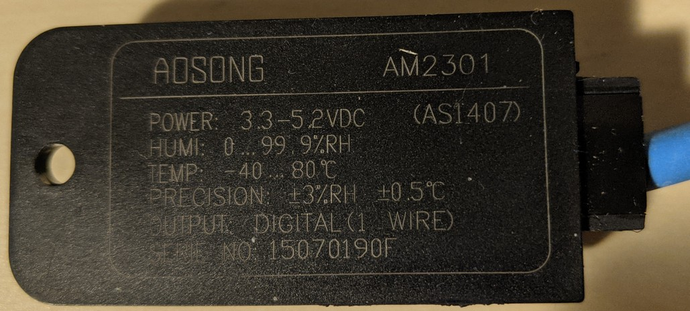
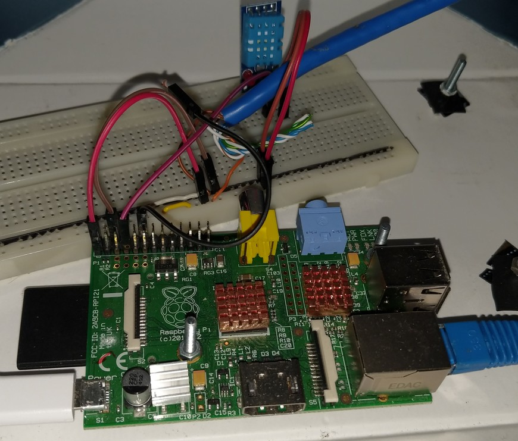

# Raspberry Pi et AM2301

Ceci est une simple histoire de mise en oeuvre d'un capteur de température et humidité avec un RaspberryPi 1B.

## Important

Ce depots est basé sur [https://github.com/kporembinski/DHT21-AM2301](https://github.com/kporembinski/DHT21-AM2301) avec mes notes et ajout pour fonctionner avec mes tests et attentes

## Commencement

Le capteur est un AM2301 qui est semblable à un DHT22 mais vous verrez qu'il ne fonctionne pas tout à fait de la même manière. 

 </img>

Lors de son achat en 2016, il ne fonctionnait pas avec le Rpi1 avec des tests par défaut.
En 2018, la mise en place d'un OrangePi zéro H2+ avec ce capteur a permit de le faire fonctionner ([lien](https://github.com/jingl3s/DHT11-DHT22-Python-library-Orange-PI)).

Pour faire court :
* La résistance  de tirage est déjà présente 
* Avec un petit peu d'huile de coude et heure, le dépôt suivant avec du code Pythons a fonctionné. 
* Le code a ensuite été intégré dans quelques autre projets sur OrangePi et un affichage ssd 1306 en i2c [lien](https://github.com/jingl3s/OrangePiZero_OLED_Dht_display)

Mais avec le mise en place de home-assistant sur un netbook et un capteur DS18B20, il fallait bien se rendre à l'évidence que le taux d'humidité en plus serait pas mal.

Nous y voila en 2021 en train de bricoler ce capteur avec un Rpi1 pour ensuite le mettre sur le Rpi associé à home-assistant.

## Investigations


 </img>


Voici la liste des différents tests effectués. 

* Installation de la solution fournie par adafruit
  * [circuitpython-on-raspberrypi-linux](https://learn.adafruit.com/circuitpython-on-raspberrypi-linux/installing-circuitpython-on-raspberry-pi)
  * voir [README_commandes.md](README_commandes.md)
  * Le capteur ne fournis pas de valeurs
  * Utilisation des GPIO 4 (pin 7) et GPIO 18 (pin 12)
  * Tests avec le code source pour appel des fonctions intermédiaire pour voir ce qu'il reçoit et décode
    * [adafruit_dht.py](https://github.com/adafruit/Adafruit_CircuitPython_DHT/blob/master/adafruit_dht.py)
    * Il reçoit bien la trame mais la conversion en Binaire ne semple pas fonctionner
    * [Anomalie similaire](https://github.com/adafruit/Adafruit_CircuitPython_DHT/issues/33)
* Utilisation d'un capteur DHT11
  * Toujours pas de valeurs
* Connexion sur Orange Pi zero pour voir un affichage correct
* Test de l'ancienne solution Python 
  * [Idée de base avec Domoticz](https://easydomoticz.com/dht-11-22-raspberry-ca-marche-enfin/)
  * [Adafruit_Python_DHT](https://github.com/adafruit/Adafruit_Python_DHT)
  * Le résultat et toujours néant pour AM 2301 mais des valeurs sortent pour DHT11
* Décision de basculer sur des tests avec du Code C
  * Les solutions trouvées se basent sur la bibliothèque Wiring Pi
    * `apt install wiringpi`
    * [Brochage en mode wiringPi](https://projects.drogon.net/wiringpi-pin-numbering/)
    * [Un peu d'information](http://wiringpi.com/reference/setup/)
  * [Grove dht22](https://github.com/Seeed-Studio/Grove-RaspberryPi/blob/master/Grove%20-%20Temperature%20and%20Humidity%20Sensor%20Pro/dht22.c)
    * Trop de dépendances à mettre en oeuvre
  * [Java PI4j et DHT](https://github.com/Pi4J/pi4j/issues/213)
    * Encore moins de répondants
  * [DHT22 en C](https://github.com/danichoi737/DHT22)
    * Ne retourne pas de valeurs
  * [Indices sur le probleme](https://www.raspberrypi.org/forums/viewtopic.php?p=506283#p506283)
    * Proposition d'une solution en remplacent la lecture avec du I2C
* Ensuite basculement en mode recherche AM2301
  * [https://electronics.stackexchange.com/questions/236530/dht21-am2301-sensor-not-measuring-humidity](https://electronics.stackexchange.com/questions/236530/dht21-am2301-sensor-not-measuring-humidity)
    * Il n'est pas recommendé de faire une lecture avec des temps calculé dans le Code car peu induire des erreurs de lecture ( information pour plus tard si erreurs)
  * [https://github.com/technion/lol_dht22](https://github.com/technion/lol_dht22)
    * ./configure cherche wiringpi a une place différente
    * Abandon
  * [https://github.com/kporembinski/DHT21-AM2301](https://github.com/kporembinski/DHT21-AM2301)
    * La solution qui a fonctionnée sans trop de bobos voir [Solution](#Solution)
    * Pour le développement ajout de quelques lignes de printf

## Solution

* `apt install wiringpi`
* `gpio readall`
```
 +-----+-----+---------+------+---+-Model B1-+---+------+---------+-----+-----+
 | BCM | wPi |   Name  | Mode | V | Physical | V | Mode | Name    | wPi | BCM |
 +-----+-----+---------+------+---+----++----+---+------+---------+-----+-----+
 |     |     |    3.3v |      |   |  1 || 2  |   |      | 5v      |     |     |
 |   2 |   8 |   SDA.1 | ALT0 | 1 |  3 || 4  |   |      | 5v      |     |     |
 |   3 |   9 |   SCL.1 | ALT0 | 1 |  5 || 6  |   |      | 0v      |     |     |
 |   4 |   7 | GPIO. 7 |   IN | 1 |  7 || 8  | 1 | ALT0 | TxD     | 15  | 14  |
 |     |     |      0v |      |   |  9 || 10 | 1 | ALT0 | RxD     | 16  | 15  |
 |  17 |   0 | GPIO. 0 |   IN | 0 | 11 || 12 | 1 | OUT  | GPIO. 1 | 1   | 18  |
 | ...
 +-----+-----+---------+------+---+----++----+---+------+---------+-----+-----+
  ```
* Utilisation du Physicak 12 et donc dans WiringPi 1
* Changements et compilation
```shell
cd src/am2301
nano am2301.c
# Changer _pin_am2301 = avec le numero dans WiringPi
make
```
* Lancement de la commande
`./am2301`
* Attente car il y a quand meme des pertes
```
t=23.8
rh=23.6
```
\o/

## La suite

* Modifier le code C pour retourner les valeurs dans un format simili JSON
  * Temperature
  * Humidite
  * Success ou echec
  * Nombre d'essais avant d'avoir la valeur
